## 1. Entrenamiento del modelo en el notebook

El _notebook_ realiza lo siguiente:

- **Crea un dataset** con datos de estudiantes.
    
- **Entrena un modelo** (por ejemplo, un Random Forest) para predecir la nota media.
    
- **Guarda el modelo entrenado** y las columnas de entrada necesarias con `joblib`:
    
    - `modelo_rf_nota_media.joblib`
        
    - `features_modelo.joblib`
        
- Al final del notebook, genera dinámicamente el código para la API y lo guarda en `main.py`.
    

Este notebook es como el laboratorio de ciencia de datos 🧪, donde se experimenta y prepara los elementos que se usarán en producción.

## 2. API con FastAPI (archivo `main.py`)

El archivo `main.py` que se crea automáticamente contiene:

- Una definición del API REST con FastAPI.
    
- Una clase `Estudiante` para validar los datos enviados.
    
- Una ruta POST `/predecir` que:
    
    - Toma los datos del usuario.
        
    - Los convierte en un `DataFrame` con las columnas esperadas.
        
    - Ejecuta el modelo previamente entrenado.
        
    - Devuelve la nota media estimada.
        

💡 Esta API está pensada para ejecutarse con Uvicorn o algún servidor ASGI:

bash

```
uvicorn main:app --reload
```

##  3. Interfaz gráfica con Streamlit

El script de Streamlit hace de **interfaz visual**:

- Presenta una interfaz interactiva con estilo corporativo.
    
- Recoge los datos del usuario desde sliders y formularios.
    
- Envía esos datos a tu API (`localhost:8000/predecir`) usando `requests.post`.
    
- Muestra la predicción devuelta por FastAPI.
    
- Además, tiene una segunda pestaña para visualizar datos y correlaciones del dataset.
    

## 쮺칩mo se conectan entre sí?

mermaid

```mermaid
graph TD
    A[Notebook, Dataset, Modelos] --> B["main.py - FastAPI"]
    B -->|Arranca con Uvicorn| C[API corriendo en localhost:8000]
    D[Streamlit] -->|Envía datos| C
    C -->|Devuelve Predicción| D
```





   